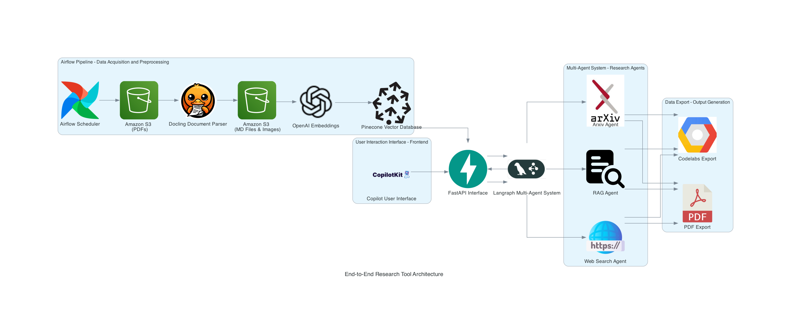

# Assignment 4: End-to-end research canvas tool

## Project Overview

This repository focuses on building an end-to-end research tool utilizing an Airflow pipeline to process documents, store vectors for fast similarity searches, and create a multi-agent research interface. The project involves parsing documents using Docling, storing vectors in Pinecone, and employing Langraph for a multi-agent system. Additionally, a user interaction interface, developed using Copilot coagent, will allow users to conduct research and save findings, culminating in a professional PDF report and structured Codelabs for clarity and future use.


## Data Flow and Architecture
Below is an overview of the data flow and ETL architecture used in the project:



## Live Application Links
- **Deployed Application**: [Streamlit App Link]
- **Google Codelabs**: [[code labs](https://codelabs-preview.appspot.com/?file_id=11XVdlzZ8DJotFKU9-hZb4OrUASjitlK7xsWqiVxxNzg#0)]
- **GitHub Repository**: [[GitHub Repo Link](https://github.com/BigData-saturdayT2/research-canvas-tool)]

## Problem Statement
Researching, extracting insights, and managing document data can be a cumbersome and time-consuming task, especially when dealing with a large volume of content. The current challenge is to build an end-to-end tool that streamlines this process—starting from document acquisition to processing, vector storage, and intelligent querying—all while providing an interactive user interface. This assignment aims to solve these issues by automating document parsing, embedding generation, and enabling an efficient research experience using multiple agents for enhanced information retrieval.

### Project Goals

1. **Automate Document Processing**: Develop an end-to-end pipeline that automates document ingestion, parsing, embedding generation, and storage using Airflow, Docling, and Amazon S3.

2. **Enable Efficient Research & Retrieval**: Utilize OpenAI embeddings, CLIP, and Pinecone to store and retrieve vectorized data for fast similarity searches, supporting both text and image queries.

3. **Implement Multi-Agent Research System**: Leverage Langraph to build a multi-agent system (Arxiv Agent, RAG Agent, Web Search Agent) to enhance document research and contextual querying capabilities.

4. **Create an Interactive User Interface**: Design a Copilot-based frontend integrated with FastAPI for seamless user interaction, enabling users to ask questions, view contextual answers, and save research notes.

5. **Generate Professional Reports**: Export research findings as Codelabs and PDF reports, providing users with comprehensive documentation of their research activities.
6. 

### Technologies Used:

1. **Airflow**: For scheduling and automating the document acquisition, processing, and embedding pipeline.
2. **Amazon S3**: For storing input PDFs and output files (Markdown, images).
3. **Docling**: Parses documents (PDFs) to extract text, tables, and images.
4. **OpenAI Embeddings (text-embedding-ada-002)**: Converts extracted text into vector embeddings.
5. **CLIP (Contrastive Language-Image Pretraining)**: Generates vector embeddings for images.
6. **Pinecone**: Vector database for storing and retrieving text/image embeddings for similarity search.
7. **Langraph Multi-Agent System**: Manages multiple agents (Arxiv, RAG, Web Search) for research queries.
8. **FastAPI**: Backend API to integrate Langraph agents and manage communication with the frontend.
9. **Copilot User Interface**: Provides an interactive frontend for document exploration, querying, and chatbot interaction.
10. **Codelabs & PDF Export**: Generates professional reports and instructional content for research findings.

## Repository Structure
```
├── frontend/                          # Streamlit application for frontend UI
├── backend/                            # FastAPI backend for user management and API services
├── images/                             # Project images and architecture diagrams
├── pipelines/                          # Airflow pipelines for PDF processing (PyPDF2 & IBM Watson)
├── .gitignore                          # Git ignore file
├── LICENSE                             # License information
├── README.md                           # Project documentation file
├── airflow_etl.ipynb                   # Jupyter notebook for ETL pipeline walkthrough
├── requirements.txt                    # Dependencies required for the project
└── s3_hf_gaia_data.py                  # Script for handling S3 data transfers
```

## Instructions for Running Locally
1. **Clone the repository**:
   ```bash
   git clone https://github.com/your-repo-name.git
   cd your-repo-name
   ```
2. **Create a virtual environment**:
   ```bash
   python -m venv myenv
   source myenv/bin/activate
   ```
3. **Install the backend requirements**:
   ```bash
   cd backend 
   poetry install
   ```
4. **Install the frontend requiremnts**:
   ```bash
   cd frontend/copilot/ui 
   npm install
   ``` 
5. **Run the backend application**:
   ```bash
   uvicorn apis.main:app --host 0.0.0.0 --port 8000 --reload
   ```
6. **Run the frontend application**:
   ```bash
   npm run dev
   ```

## Deployment
The application is containerized using Docker Compose. Run the following command to deploy:
```bash
docker-compose up
```

## Documentation
- **Codelabs**: [[Codelabs](https://codelabs-preview.appspot.com/?file_id=11XVdlzZ8DJotFKU9-hZb4OrUASjitlK7xsWqiVxxNzg#0)]
- **Video Walkthrough**: [Video Link](https://northeastern-my.sharepoint.com/:v:/g/personal/gupta_abhinav_northeastern_edu/EbrmYJED725Dms_wuTdLmfwBIWGccsxFCE79aT_SJEOJOw?e=yRpnTq)

## Contribution
All team members contributed to this project. We attest that no external work was used.

| Name     | Work Done                                                                                           |
|----------|-----------------------------------------------------------------------------------------------------|
| Abhinav (36%) | Worked on Web Search Agent, Arxiv agent, Copilot UI, FastAPI integration, Chatbot integration, SmartQuery, Docker |
| Dheer (32%)    | Worked on RAG agent, NVIDIA model integration, research notes, md conversion, text to pdf extraction, documentation                 |
| Nishita (32%)  | Worked on architecture diagram creation, Airflow pipeline, S3, Pinecone database, md to codelabs, documentation  |
